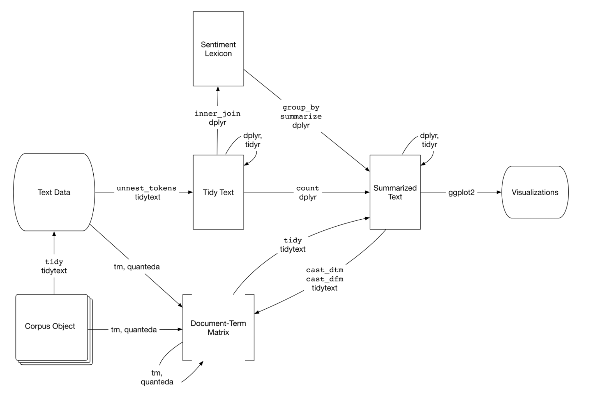
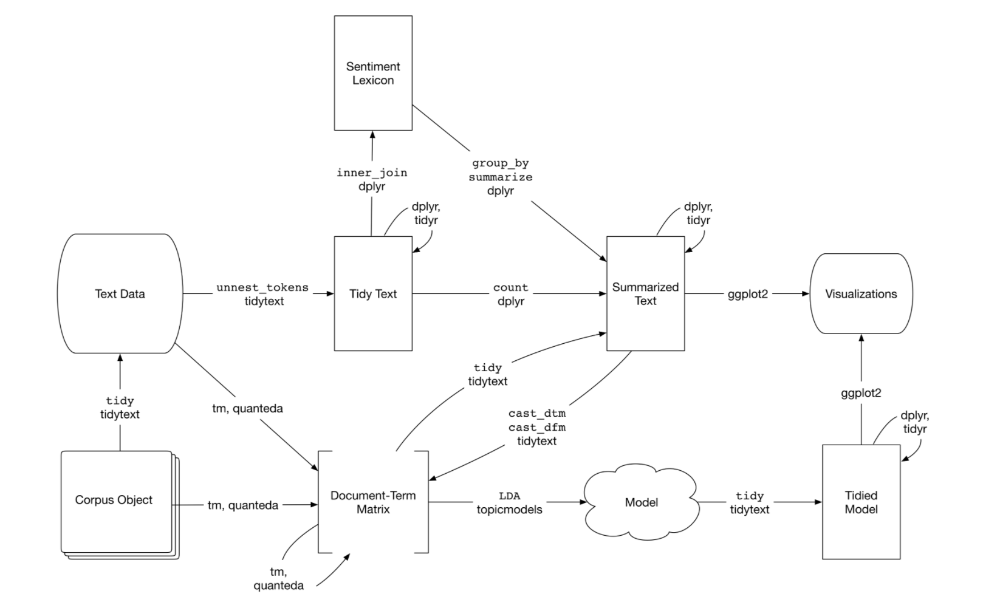

```{r setup, include=FALSE}
knitr::opts_chunk$set(echo = TRUE)
library(tm)
library(dplyr)
library(tidytext)
library(ggplot2)
library(ggthemes)
library(tidyr)
library(topicmodels)
library(rtweet)

```


## 5 Converting to and from non-tidy formats
Most of the existing R tools for NLP, besides the tidy package are not compatible with the tidy text format(one-token-per-document-per-row). In this chapter we are making connections between the tidy text format with other important packages and data structures, which allows us to use the existing text mining packages/tidy tools based on the context.

```{r}

```

## 5.1 Tidying a document-term matrix
One of the most common structures that text mining packages work with is the document-term matrix. The document-term matrix is a matrix where:

* Each row represents one documents
* Each column represents one term
* Each value (typically) contains the number of appearances of that term in that document. 

Since most terms do not occur(they have the value zero), the document-term matrix are usually implemented as sparse matrices. 

document-term matrix object cannot be used directly with tidy tools, so the tidytext package can convert between two formats.
 
* tidy() turns a document-term matrix into a tidy data frame. 
* cast() turns a tidy data frame into matrix. The tidytext provides three variation, each converting to a different type of matrix: 
  + cast_sparse() - convert to a sparse matrix 
  + cast_dtm() - convert to a document-term matrix
  + cast_dfm() - convert to a dfm(document feature matrix) object 

A document-term matrix is typically comparable to a tidy data frame after count or a group_by/summarize that contains count or other statistics for each combination of a term and document.

## 5.1.5 Tidying DocumentTermMatrix objects

I was not able to find any data that is in the document-term matrix form. So, I am using the data set provide in the text book. 
```{r}
data("AssociatedPress", package = "topicmodels")
AssociatedPress
```
There is 2246 documents and 10473 terms in the data set. We could see the terms in the document with the Terms() function
```{r}
terms <- Terms(AssociatedPress)
head(terms)
```

We can turn the document-term matrix into a tidy data format by using tidy()
```{r}
tidy_data <- tidy(AssociatedPress)
tidy_data
```

We have three variables in the tidy_data, document, term and count. This is something that I am familiar with. We can perform sentiment analysis or plot as we did in earlier chapter.

```{r}
ap_sentiments_bing <- tidy_data %>%
  inner_join(get_sentiments("bing"), by = c(term = "word"))
ap_sentiments_bing

ap_sentiments_afinn <- tidy_data %>%
  inner_join(get_sentiments("afinn"), by = c(term = "word"))
ap_sentiments_afinn

ap_sentiments_nrc <- tidy_data %>%
  inner_join(get_sentiments("nrc"), by = c(term = "word"))
ap_sentiments_nrc

```

First looking at the sentiments from bing package, we cab see the postive or negative words in our data.

```{r}
ap_sentiments_bing%>%
  count(sentiment, term, wt = count) %>%
  filter(n >= 200) %>%
  mutate(n = ifelse(sentiment == "negative", -n, n)) %>%
  mutate(term = reorder(term, n)) %>%
  ggplot(aes(term, n, fill = sentiment)) +
  geom_bar(stat = "identity") +
  ylab("Contribution to sentiment") +
  coord_flip()
```

trying out theme_minimal() and theme_classic() and theme_clean()

```{r}
ap_sentiments_bing%>%
  count(sentiment, term, wt = count) %>%
  ungroup() %>%
  filter(n >= 200) %>%
  mutate(n = ifelse(sentiment == "negative", -n, n)) %>%
  mutate(term = reorder(term, n)) %>%
  ggplot(aes(term, n, fill = sentiment)) +
  geom_bar(stat = "identity") +
  ylab("Contribution to sentiment") +
  coord_flip()+
  theme_minimal()

ap_sentiments_bing%>%
  count(sentiment, term, wt = count) %>%
  ungroup() %>%
  filter(n >= 200) %>%
  mutate(n = ifelse(sentiment == "negative", -n, n)) %>%
  mutate(term = reorder(term, n)) %>%
  ggplot(aes(term, n, fill = sentiment)) +
  geom_bar(stat = "identity") +
  ylab("Contribution to sentiment") +
  coord_flip()+
  theme_classic()

ap_sentiments_bing%>%
  count(sentiment, term, wt = count) %>%
  ungroup() %>%
  filter(n >= 200) %>%
  mutate(n = ifelse(sentiment == "negative", -n, n)) %>%
  mutate(term = reorder(term, n)) %>%
  ggplot(aes(term, n, fill = sentiment)) +
  geom_bar(stat = "identity") +
  ylab("Contribution to sentiment") +
  coord_flip()+
  theme_clean()
```

## 5.1.2 Tidying dfm objects
Other text mining packages provide alternative implementations of document-term matrices, such as the dfm (document-feature matrix) class.

There is no explanation for DFM, This is what I found on Google: "refers to documents in rows and “features” as columns" 

What is features in this context? What is the difference between DFM and DTM?

I do not know how to turn data into DFM right now. So, I am using data set from the text book
```{r}
data("data_corpus_inaugural", package = "quanteda")
inaug_dfm <- quanteda::dfm(data_corpus_inaugural, verbose = FALSE)
inaug_dfm
```

Use tidy() to turn the DFM into tidy format

```{r}
inaug_td <- tidy(inaug_dfm)
inaug_td
```

Now, we may perform tf_idf calculation to see the important words in each document.
```{r}
inaug_tf_idf <- inaug_td %>%
  bind_tf_idf(term, document, count) %>%
  arrange(desc(tf_idf))

inaug_tf_idf
```

Visualize the words most specific to each document
```{r}
inaug_tf_idf %>% 
  group_by(document) %>% 
  filter(document == "1793-Washington" | document == "2009-Obama") %>% 
  top_n(20, tf_idf) %>% 
  arrange(desc(tf_idf)) %>% 
  ungroup() %>% 
  ggplot(aes(term, tf_idf, fill = document)) +
  geom_col(show.legend = FALSE) +
  labs(x = NULL, y = "tf-idf") +
  facet_wrap(~document, ncol = 2, scales = "free") +
  coord_flip()
```

Notice that "(" and ")" are mark as a term, in the data set. But using unnest_tokens will remove them.


We can also get a visualization of the changes in word usage from year to year. 

```{r}

year_term_counts <- inaug_td %>%
  extract(document, "year", "(\\d+)", convert = TRUE) %>%
  complete(year, term, fill = list(count = 0)) %>%
  group_by(year) %>%
  mutate(year_total = sum(count))

year_term_counts %>%
  filter(term %in% c("america", "foreign", "freedom")) %>%
  ggplot(aes(year, count / year_total)) +
  geom_point() +
  geom_smooth() +
  facet_wrap(~ term, scales = "free_y") +
  scale_y_continuous(labels = scales::percent_format()) +
  ylab("% frequency of word in inaugural address")
```

## 5.2 Casting tidy text data into a matrix
Use cast_dtm to cast a tidy data into document-term matrix
```{r}
tidy_data %>% 
  cast_dtm(document, term, count)
```

We could also cast the tidy data into a document-feature matrix object using cast_dfm()
```{r}
tidy_data %>% 
  cast_dfm(document, term, count)
```

We can also turn the news data in chap 1-4 into document-term matrix

```{r include=FALSE}

newsdata <- c("Some provinces are scrambling to increase testing capacity as coronavirus infections spike across Canada and lineups at COVID-19 testing sites see a significant influx of people. 

In order to accommodate demand, opening hours at two Ottawa assessment centres will be extended in the coming days, Ottawa Public Health, Children's Hospital of Eastern Ontario and Ottawa Hospital said in a joint statement Monday afternoon. 

The statement said the health authorities are hiring more staff and training them so that the Brewer assessment centre can accept patients for 12 hours per day, seven days a week — four more hours per day than it is normally open.

We knew that with the kids returning to school we would see these volumes. To prepare, we have tripled staffing in the last month for testing children and youth at the [Brewer Arena assessment centre]. More are being trained and still more are being hired, the statement said. As of 3:15 p.m. ET on Tuesday, Canada had 138,572 confirmed or presumptive coronavirus cases. Provinces and territories listed 121,555 of those as recovered or resolved. A CBC News tally of deaths based on provincial reports, regional health information and CBC's reporting stood at 9,226.

At a news conference Tuesday, Ontario Premier Doug Ford said the coronavirus is continuing to spread.

The province announced 251 new cases Tuesday, with the majority of those cases found in Toronto, Ottawa and Peel region with 73, 51 and 42 cases, respectively. 

As we see around the world, countries are getting hammered by COVID-19, said Ford.

He also said he believes a second wave of the virus is coming to the province and said officials are cautioning that the second wave could be more complicated than the first one. Ford said Ontario is now expanding testing and building up a supply of personal protective equipment in anticipation of a continued spike in cases. 

At an Ottawa council meeting last Wednesday, elected officials from across the city called for an expansion of its testing system to better meet demand.

Part of our future success will depend on our ability to test, to test rapidly and to remove barriers to access to testing, said Rideau-Vanier Coun. Mathieu Fleury in an interview with CBC.

In London, Ont., a long line of cars was seen waiting outside the city's only open assessment centre — the Carling Heights Optimist Centre — on Sunday.

The Middlesex-London Health Unit said the lengthy wait was partly due to a staffing shortage at that location.

Many of the cars in line at the Carling Heights Optimist Centre were filled with young people looking to get tested.Quebec recorded 291 new cases of COVID-19 on Tuesday, which is the sixth day in a row the province has reported more than 200 cases.

In response to the rising number of infections, Quebec Premier François Legault warned the public that social gatherings must be limited immediately in order to avoid closing schools and businesses.

The situation is critical. It's worrisome, and we must act now, he said at a news conference Tuesday. Legault also said Quebec faces a real risk of a second wave.

Quebec City and the Lower Saint-Lawrence regions are being closely monitored and may be moved to the orange alert level, up from yellow, indicating an increased risk of COVID-19 to the public, sources told Radio-Canada.

Health Minister Christian Dubé said at the same news conference that an orange classification would mean the closure of bars and reducing the number of people allowed in private gatherings from 10 to six. At the federal level, Chief Public Health Officer Dr. Theresa Tam said Tuesday that the government is currently working closely with provincial microbiology labs to enhance test processing capacity. 

Tam told reporters that the current national capacity is beyond 60,000 [tests per day] at the national level.  

She said Canada needs to augment the portfolio of testing capabilities in Canada to include new technology like rapid saliva tests.  

Testing issues have also been reported in St. John's, with local mother Flora Salvo saying she spent four days on the phone trying to book a COVID-19 test and that the reservation system needs to be revamped.

She said the painfully slow process of getting tested — from her first call to when she received a negative result last Saturday — stretched over a full week. 
" ,

"TORONTO -- Rising numbers of COVID-19 cases in multiple provinces are stoking fears of a potential second wave, and one infectious disease expert says this surge in infections might 'very well' be the start of that next phase in the pandemic.

Infectious disease specialist Dr. Isaac Bogoch says that current upward trends in B.C., Alberta, Manitoba, Ontario and Quebec may be fuelling Canada’s second wave of coronavirus infections.

It might be, it very well might be. We're certainly seeing these cases rumble up in the wrong direction, and quite frankly what happens over the next few weeks and then over the next month or two ahead really depends on us. If we let our guard down as citizens, if we let our guard down for example as businesses and organizations, then we'll see a spike in cases, Bogoch told CTV's Your Morning on Tuesday.
", 

"
Knoxdale-Merivale councillor and Ottawa Board of Health chair Keith Egli said Tuesday that school reopenings remain a priority, particularly in light of concerns over children’s mental health and emotional well-being during the past six months.

“All society is impacted when people cannot rely on schools to support childhood development and economic activity,” he said, adding that Ottawa Public Health has prioritized working with school boards to help ensure a successful return to classes, meeting weekly to review plans and feedback, and provide guidance.

Dr. Etches also addressed the possibility, raised earlier in the day by Ontario Premier Doug Ford, of the province’s returning to stricter measures and lockdowns to help contain the spread of COVID-19, especially in current hotspots such as Ottawa, Toronto and the Peel region.

“We’re in favour of a risk-based approach, absolutely. We know that larger centres are always going to have a greater risk of transmission of COVID, for many reasons — density of population and sheer numbers of people — so we absolutely support an approach based on risk.”

Ottawa will be expanding the hours and capacity of its care clinics and COVID-19 assessment centres, as school reopenings have led to greatly increased lineups and wait times at those sites, particular at Brewer Arena.

Dr. Alan Forster, the testing strategy lead with the Champlain COVID-19 Response Committee, made the announcement Tuesday, indicating that the levels of testing in the area, currently at about 2,000 per day, could increase to 3,000 with increased hours and staffing, and as much as 3,500 if mobile testing in schools and other such venues is added.


Forster said he expects that Brewer Arena and the Coventry Road sites will increase from eight hours a day to 12, seven days a week. Care clinics operated by the Queensway-Carleton and Montfort hospitals will expand their weekend hours.

The changes, he added, are expected to take place in the next week.

Yet Ottawa’s chief medical officer of health, Dr. Vera Etches, urged residents to only seek out testing if they display symptoms of have come in direct contact with those who have tested positive.

Instead, she recommended that people reexamine and possibly modify their behaviours to ensure they’re limiting the number of close contacts in their circle and following other precautions, including avoiding large social gatherings.

“There is potential harm when the value of asymptomatic testing is low, and it’s displacing people who need to have a test,” said Etches. “And the labs need to be able to turn around the results quickly for controlled outbreaks and school-setting investigations.”

Etches reinforced Ottawa Public Heath’s position that social networks, and not businesses, are largely driving infections up. Most of the cases, she said, are related to outbreaks, such as those at long-term care facilities, or, in about one-quarter of cases, of unknown origin.

“The rest of the cases are what we call sporadic, either usually linked to a household close contact or a social group close contact. That is the most common source of exposure.

“We have very few workplace outbreaks that have been identified,” she added, “but we know everything’s connected.

“The call today is for each of us to think about how many close contacts did you have this week where you were within two metres, especially indoors without a mask on? In each of those situations, that could be connected to a chain of transmission.

“We want everybody to do their part to decrease those numbers of close contacts in our lives.”

Ottawa reported 52 new cases of COVID-19 on Tuesday, down from 61 reported Monday.

Five residents at West End Villa long-term care home have died from complications resulting from COVID-19.

Extendicare, which manages the facility, confirmed the deaths in a statement from West End Villa administrator Kelly Keller on Monday.

One of the deaths had previously been reported.

“We are deeply saddened to share that as of September 14, five of our residents have passed away from complications related to COVID-19,” Keller wrote in statement. “We have been in contact with the families of these residents and offer them our condolences in this difficult time. All families with loved ones at Extendicare West End Villa have also been informed.

“We cannot comment further on our residents out of respect for their privacy and the privacy of their families.”

The 242-bed Elmira Avenue facility was listed as being in outbreak status by Ottawa Public Health effective Aug. 30. According to the province’s latest figures, 46 residents and nine staff members have tested positive.

Advertisement
Article content continued
“We have conducted a second round of COVID-19 surveillance testing to help ensure our cohorting efforts are as effective as possible,” added Keller, “and we expect to receive the results of those tests over the coming days.

Ottawa Public Health reported 52 new COVID-19 cases and four new deaths Tuesday, bringing those totals to 3,335 and 272, respectively.

Nine Ottawa residents are currently hospitalized with COVID-19, but none are in intensive care.

There are currently 362 active cases in Ottawa, while 2,753 have been resolved.

Additionally, OPH confirms 19 health-care or child-care establishments with outbreaks, an increase of one from Monday’s report. The most recent addition to OPH’s institutional outbreak list is Riverview Development Services, which reported one staff case.

Meanwhile, two more Ottawa French-language schools have reported people who have COVID-19, bringing the total number of people testing positive to 11 at nine Ottawa schools.

The new Ottawa schools identified in the provincial database on Tuesday are Marius-Barbeau elementary, with one case, and Gabrielle-Roy elementary, with two cases. All three individuals were not staff or students, but are listed as “other.”

Provincial

Ontario Premier Doug Ford hinted on Tuesday that the province may soon offer asymptomatic COVID-19 testing through pharmacies such as Shopper’s Drug Mart.

Citing the long lineups for testing, particularly after school openings in the province have prompted more people to seek testing, Ford indicated that he spoke earlier in the day with the CEO of Shopper’s, and that an announcement on the matter is forthcoming.

“You’ll be hearing from us over the next couple of days,” Ford said. “I just want to make sure that all the ducks are in a row and then we’ll make an announcement.

“I’m not going to say that 100 per cent, but we’re all over it.”

The premier also would not rule out the possibility of the province further clamping down on social gatherings to help stem the recent increase in COVID-19 cases, indicating that he’s been in talks with Ottawa Mayor Jim Watson, Toronto Mayor John Tory and Brampton Mayor Patrick Brown to get their input on the issue.")

newsdata
news_word <- tibble(article = c("1", "2","3"), text = newsdata)
news_word

news_dtm <- news_word %>%
  unnest_tokens(word, text) %>%
  anti_join(stop_words) %>% 
  count(article, word) %>%
  cast_dtm(article, word, n)

news_dtm

```
## 5.3 Tidying corpus objects with metadata
Some data structures are designed to store document collections before tokenization, often called a “corpus”. A corpus object is structured like a list, with each item containing both text and metadata(infomation such as the author, id, language).

We can also turn corpus into tidy format by using tidy(), and perform any text mining techniques such as sentiment analysis and tf-idf.


## 5.4 Summary 
Text data may be organized in many different format for different purpose, we may need to convert it between different form. For example, converting tidy text data frame into document-term matrices. 


## 6 Topic modeling
When we have collections of documents, we may want to divide into natural groups so that we can understand them separately. Topic modeling is a method for unsupervised classification of such documents, similar to clustering. 

Laten Dirichlet allocation (LDA) is a popular method for fitting a topic model. LDA treats each document as a mixture of topics, and each topic contains mixture of words. This allows documents to have same terms, rather than separate each term into discrete groups. 

A updated flow chart:
```{r}

```
 
In this chapter, we’ll learn to work with LDA objects from the topicmodels package, particularly tidying such models so that they can be manipulated with ggplot2 and dplyr. We’ll also explore an example of clustering chapters from several books, where we can see that a topic model “learns” to tell the difference between the four books based on the text content.

## 6.1 Latent Dirichlet allocation
Two principles of Latent Dirichlet allocation:

* Every document is a mixture of topics. (each document may contain words from several topics. In a two-topic model "Document 1 is 90% topic A and 10% topic B, while Document 2 is 30% topic A and 70% topic B.) 
* Every topic is a mixture of words. (two-topic model of American news, with one topic for “politics” and one for “entertainment.” The most common words in the politics topic might be “President”, “Congress”, and “government”, while the entertainment topic may be made up of words such as “movies”, “television”, and “actor”. Importantly, words can be shared between topics; a word like “budget” might appear in both equally.)

LDA is a mathematical methods that estimates the mixture of words associated with each topic and mixture of topics that describes each document 

Applying LDA to my news data 

```{r}
news_dtm
news_lda <- LDA(news_dtm, k = 2, control = list(seed = 1234))
news_lda
```

## 6.1.1 Word-topic probabilities
The tidytext package provides this method for extracting the per-topic-per-word probabilities, called  $β$ (“beta”), from the LDA model.
```{r}
news_topics <- tidy(news_lda, matrix = "beta")
```

We can use top_n() to find the 10 terms that are most common within each topic
```{r}
news_top_terms <- news_topics %>%
  group_by(topic) %>%
  top_n(10, beta) %>%
  ungroup() %>%
  arrange(topic, -beta)

news_top_terms %>%
  mutate(term = reorder_within(term, beta, topic)) %>%
  ggplot(aes(term, beta, fill = factor(topic))) +
  geom_col(show.legend = FALSE) +
  facet_wrap(~ topic, scales = "free") +
  coord_flip() +
  scale_x_reordered()+
  theme_light()
```

The plot shows the most common words for two topic, "testing", "Ottawa", "covid-19" are in both topic. This is an advantage of topic modeling as opposed to “hard clustering” methods: topics used in natural language could have some overlap in terms of words.

As an alternative, we could consider the terms that had the greatest difference in  
$β$ between topic 1 and topic 2. This can be estimated based on the log ratio of the two:$log_2(\frac{\beta_2}{\beta_1})$ (a log ratio is useful because it makes the difference symmetrical).

```{r}
beta_spread <- news_topics %>%
  mutate(topic = paste0("topic", topic)) %>%
  spread(topic, beta) %>%
  filter(topic1 > .008 | topic2 > .008) %>% # filter the relevant common words 
  mutate(log_ratio = log2(topic2 / topic1))

beta_spread
beta_spread %>%
  ggplot(aes(reorder(term, log_ratio), log_ratio)) +
  geom_col(show.legend = FALSE) +
  coord_flip() +
  scale_x_reordered()+
  theme_light()
```

In the bar plot, We can see the Words with the greatest difference in $\beta$ probability between topic 2 and topic 1. (log ration of 1 means $beta_2$ are twice as large as $\beta_2$, log ratio of -1 means $\beta_1$ is twice as large then $\beta_2$)

Because we have a small data set and all the news data are related to covid-19. So, our output is not very interesting.

## Document-topic probabilities
Besides estimating each topic as a mixture of words, LDA also models each document as a mixture of topics.
We can examine the per-document-per-topic probabilities, called $\gamma$, with the matrix = "gamma" argument in tidy()
```{r}

news_documents <- tidy(news_lda, matrix = "gamma")
news_documents
```

Each of the gamma values is an estimated proportion of words from that document that are generated form that topic. Our model estimated that 99.9% of the words in document 1 were generated from topic 1. Having gamma close to 0 means that it is mostly words generated from other topic.

## 6.2 Example: the great library heist
In this section, the textbook uses four book data set, and perform LDA topic modeling as we did in 6.1. So, I am going over general procedure of LDA topic modeling analysis. 

* First of all, we need to know the format of our data set. If our data set is in DTM, we will have to turn in into tidy format by using tidy(). Then some data manipulation may be needed
* use unnest_tokens() to separate the text into words then remove stop words by anti_join()
* find document-word count by using count()
* turn the data into DTM format by using cast_dtm()
* use LDA() to build LDA model, specify value k, where k is the number of topics
* examine per-topic-per-word probabilities by using tidy(data, matrix = "beta"), then plot using ggplot to get a visualization
* examine per-document-per-topic probabilities by using tidy(data, matrix = "gamma") then plot using ggplot to get a visualiaztion
* find which words in each document were assigned to which topic by using augment()
* if we already know the cluster label, we may find which words were incorrectly classified  and create a confusion matrix to show how often words from one topic were assigned to another. 

## 6.3 Alternative LDA implementations
The LDA() function in the topicmodels package is only one implementation of the latent Dirichlet allocation algorithm. The mallet package also provides text classification tools. However, the mallet package requires the data to be one string for each document before performing LDA
```{r}
library(mallet)
news_word
file.create(empty_file <- tempfile())
docs <- mallet.import(news_word$article, news_word$text, empty_file)

mallet_model <- MalletLDA(num.topics = 2)
mallet_model$loadDocuments(docs)
# mallet_model$train(100)

# word-topic pairs
tidy(mallet_model)

# document-topic pairs
tidy(mallet_model, matrix = "gamma")

```
Then we could use ggplot2 to explore and visualize the model in the same way we did the LDA output.

## 6.4 Summary
In this chapter, I learned how to switch between different text data format. For example, switch between tidy and document-term matrix format. Also, I learned the Latent Dirichlet allocation topic model, and use it to find the clusters of words that characterize a set of documents. Note that there is limitation with LDA model, which is  that the model may have incorrectly assign words to other topics. 


# Overall summary
There are many different types of data structure for different purpose. For example, with the tidy format, we may perform sentiment analysis, word frequency, and N-grams easily. However, with other data structure such as document-term matrix, we can use Latent Dirichlet allocation to build topic model. Also, keep in mind that these we can easily transform tidy data into DTM or other way around. \newline
From topic modeling section, I learned the Latent Dirichlet allocation model. I think it is a very useful model for categorize different kind of document. I think we may use it to categorize different types of youtube video category (tech, vlog, sport.etc) based on its auto generated subtitle. However, it is a unsupervised learning algorithm, it is hard to select correct number of topics in our data. That may be another limitation of this model. \newline
From chap 7 case study, I learned that every time you get a data set, you should look into the data structure and the variables. Then think about NLP techniques that may apply to the data set. I also found it hard to manipulate the data set into the format that I want it to be. That maybe something I need more practice on. (my chap 7 rcode is little messy)\newline
I also explored many ggplot themes and colors in these section, I am planning to do a ggplot summary combine some of clean and aesthetic themes in the future.